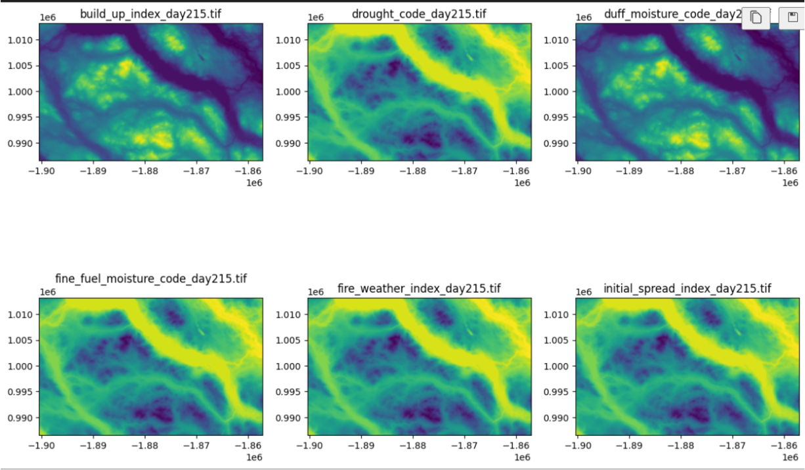
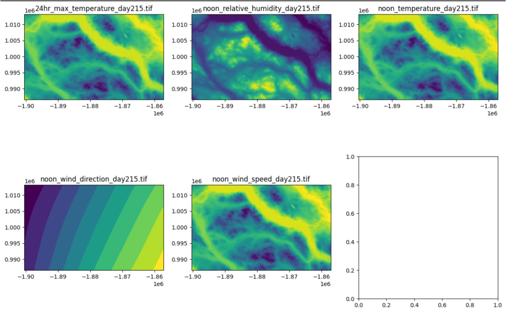
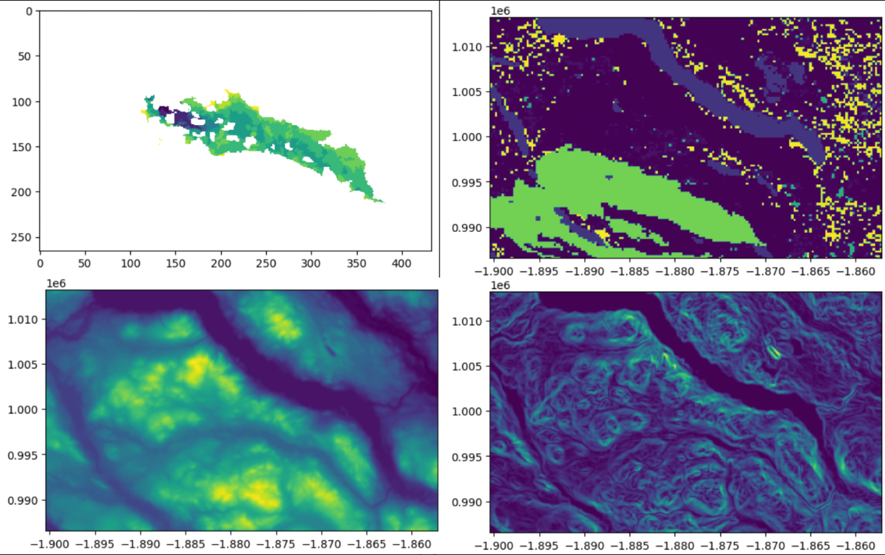

# Submitted to Wildfire AI Hackathon 2024

# Extinguish with AI - Wildfire Path Predictor

## 💡 What was the Inspiration Behind Our Wildfire Path Predictor 🌳
Wildfires are a massive issue, both globally and nationally. With recent changes across the world due to climate change, the quantity and magnitude of wildfires have skyrocketed around the world. Countries who've experienced little to no fires now see a plethora of forest-burning monsters. Just last year, Canada experienced one of its worst forest fires with the Quebec wildfire, having the damage spread to several parts of Canada and America. Several countries had to send help to assist Canada in fighting this fire. Climate change has resulted in Canada suffering many more wildfires that behave, move, and burn in very different patterns. With the growing quantity of fires, Canada's usually periodic fires have turned into a constant growth, and the industry is facing issues with a lack of human and financial resources to fight these fires.

## Our Solution to Extinguish with AI!
Introducing our Wildfire Path Predictor, an AI model that predicts the path wildfires in different regions will grow in! There are three key solution aspects
- Using an AI model, we leveraged satellite data from MODIS, VIIRS, and IBAND to train our model to effectively and accurately predict paths to assist ground and ariel crew 🧯
- By training on region-specific data, our model efficiently predicts the shifts in fire path trends caused by climate change 🌍
- With a focus on scalability and low cost, our solution can be used wide scale in the industry to relieve pressure caused by the lack of human and financial resources 💰

## 🚒 How Our Solution Works 🧯
By extracting data from satellite images using the MODIS, VIIRS, and IBAND satellites, and preprocessing them into trainable data, we used the following

1. **Fire Growth Data:** By utilizing the ignition point of a fire and the consequent fire path growth, our model effectively predicted the growth of a wildfire
2. **Fire Weather Data:** Focusing on weather data related to fire, such as moisture factors like Fine Fuel Moisture Code (FFMC) & Duff Moisture Code (DMC), lack of water through Drought Code (DC), and using these to calculate Initial Spread Index (ISI) and Build Up Index (BUI) to finally get the Fire  Weather Index (FWI) to train our model effectively
3. **Weather Data:** To effectively capture the shifts caused by climate change, we emphasized data like Wind Speed (WSI) and Wind Direction (WDI), paired with relative humidity (WRH),  and relative temperature (NTP) & 24h Max Temperature (MTP)
4. **Topology:** Using the elevation and slope of an area along with region-specific training data, our model effectively predicts paths based on local landscape
5. **Fuel Burning Behaviour:** By giving our AI the tree species and wood, vegetation, and soil, and the burning data of these materials, our model more effectively predicted patterns

Let's take a look at some of the raw satellite data we preprocessed

In this project, we utilized PyTorch and Torchvision to train a model aimed at predicting wildfire spread. The problem of wildfire spread is inherently both spatial and temporal. To address these complexities, we employed a hybrid approach combining Convolutional Neural Networks (CNNs) for spatial data processing and Long Short-Term Memory (LSTM) networks for temporal data processing. CNNs are adept at capturing spatial patterns and features from satellite images, while LSTMs are effective in handling temporal dependencies over sequential data. By carefully designing the architecture and adjusting the dimensions of layers and nodes, we ensured that the model could efficiently process large volumes of data. This combined approach allowed us to better capture the dynamic nature of wildfires, resulting in more accurate predictions of fire spread.

## Technologies Used 💻
- **Python**
- **PyTorch**
- **Torchvision**
- **Numpy**
- **Pandas**
- **Geopandas**
- **Rasterio**
- **Scikit-learn**
- **TQDM**

# Notes & Contact
All data from the git repository is left as blank. If you would like to learn more about the project or access the dataset used, please feel free to contact me.
**Email:** [a236pate@uwaterloo.ca](mailto:a236pate@uwaterloo.ca)
**LinkedIn:** [linkedin.com/in/aryanpatel05](https://linkedin.com/in/aryanpatel05)
  

